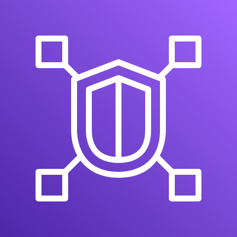

# AWS Gateway API Controller for VPC Lattice

AWS Application Networking is an implementation of the Kubernetes [Gateway API](https://gateway-api.sigs.k8s.io/). This project is designed to run in a Kubernetes cluster and orchestrates AWS VPC Lattice resources using Kubernetes Custom Resource Definitions like Gateway and HTTPRoute.

## Security

See [CONTRIBUTING](CONTRIBUTING.md#security-issue-notifications) for more information.

## License

This project is licensed under the Apache-2.0 License.
