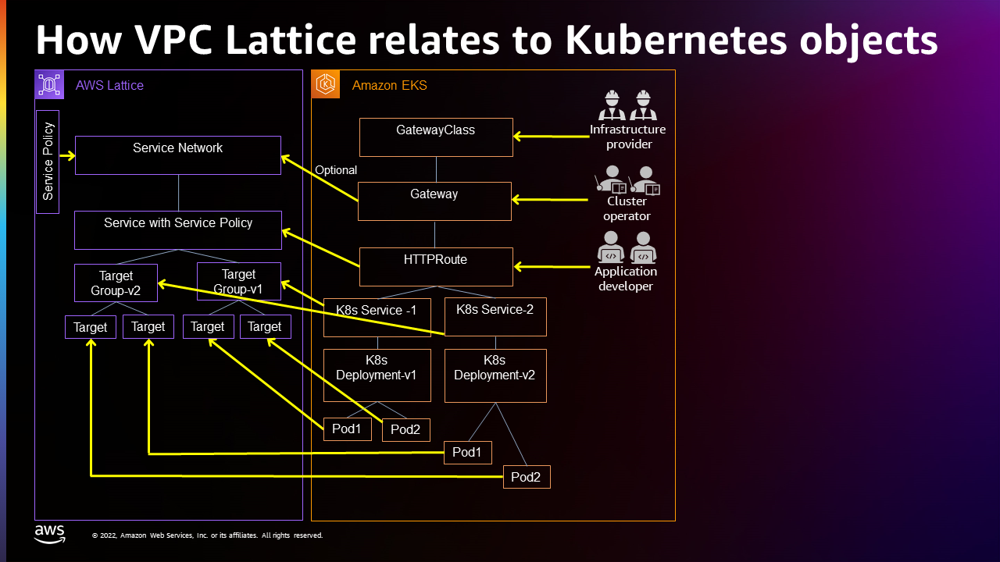

# Understanding the Gateway API Controller

For medium and large-scale customers, applications can often spread across multiple areas of a cloud.
For example, information pertaining to a company’s authentication, billing, and inventory may each be served by services running on different VPCs in AWS.
Someone wanting to run an application that is spread out in this way might find themselves having to work with multiple ways to configure:

- Authentication and authorization
- Observability
- Service discovery
- Network connectivity and traffic routing

This is not a new problem.
A common approach to interconnecting services that span multiple VPCs is to use service meshes. But these require sidecars, which can introduce scaling problems and present their own management challenges, such as dealing with control plane and data plane at scale.

If you just want to run an application, you should be shielded from details needed to find assets across multiple VPCs and multiple clusters. You should also have consistent ways of working with assets across your VPCs, even if those assets include different combinations of instances, clusters, containers, and serverless. And while making it simpler to run multi-VPC applications easier for users, administrators still need the tools to control and audit their resources to suit their company’s compliance needs.

## Service Directory, Networks, Policies and Gateways

The goal of VPC Lattice is to provide a way to have a single, over-arching services view of all services across multiple VPCs.
You should also have consistent ways of working with assets across your VPCs, even if those assets include different combinations of instances, clusters, containers, and serverless.
The components making up that view include:

- Service Directory: This is an account-level directory for gathering your services in once place.
  This can provide a view from the VPC Lattice section of the AWS console into all the services you own, as well as services that are shared with you.
  A service might direct traffic to a particular service type (such as HTTP) and port (such as port 80).
  However, using different rules, a request for the service could be sent to different targets such as a Kubernetes pod or a Lambda function, based on path or query string parameter.

- Service Network: Because applications might span multiple VPCs and accounts, there is a need to create networks that span those items.
  These networks let you register services to run across accounts and VPCs.
  You can create common authorization rules to simplify connectivity.

- Service Policies: You can build service policies to configure observability, access, and traffic management across any service network or gateway.
  You configure rules for handling traffic and for authorizing access.
  For now, you can assign IAM roles to allow certain requests.
  These are similar to S3 or IAM resource policies.
  Overall, this provides a common way to apply access rules at the service or service network levels.

- Service Gateway: This feature is not yet implemented.
  It is meant to centralize management of ingress and egress gateways.
  The Service Gateway will also let you manage access to external dependencies and clients using a centrally managed VPC.

If all goes well, you should be able to achieve some of the following goals:

- Kubernetes multi-cluster connectivity: Say that you have multiple clusters across multiple VPCs.
  After configuring your services with the Kubernetes Gateway API, you can facilitate communications between services on those clusters without dealing with the underlying infrastructure.
  VPC Lattice handles a lot of the details for you without needing things like sidecars.
- Serverless access: VPC Lattice allows access to serverless features, as well as Kubernetes cluster features.
  This gives you a way to have a consistent interface to multiple types of platforms.

With VPC Lattice you can also avoid some of these common problems:

- Overlapping IP addresses: Even with well-managed IP addresses, overlapping address use can occur by mistake or when organizations or companies merge together.
  IP address conflicts can also occur if you wanted to manage resources across multiple Kubernetes clusters.
- Sidecar management: Changes to sidecars might require those sidecars to be reconfigured or rebooted.
  While this might not be a big issue for a handful of sidecars, it can be disruptive if you have thousands of pods, each with its own sidecar.

## Relationship between VPC Lattice and Kubernetes

As a Kubernetes user, you can have a very Kubernetes-native experience using the VPC Lattice APIs.
The following figure illustrates how VPC Lattice objects connect to [Kubernetes Gateway API](https://gateway-api.sigs.k8s.io/) objects:

As shown in the figure, there are different personas associated with different levels of control in VPC Lattice.
Notice that the Kubernetes Gateway API syntax is used to create the gateway, HTTPRoute and services, but Kubernetes gets the details of those items from VPC Lattice:

- Infrastructure provider: Creates the Kubernetes GatewayClass to identify VPC Lattice as the GatewayClass.
- Cluster operator: Creates the Kubernetes Gateway, which gets information from VPC Lattice related to the Service Gateway and Service Networks, as well as their related Service Policies.
- Application developer: Creates HTTPRoute objects that point to Kubernetes services, which in turn are directed to particular pods, in this case.
  This is all done by checking the related VPC Lattice Services (and related policies), Target Groups, and Targets
  Keep in mind that Target Groups v1 and v2 can be on different clusters in different VPCs.
