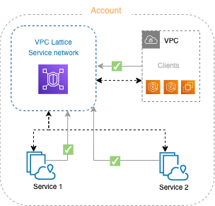

# Understanding the Gateway API Controller

For medium and large-scale customers, applications can often spread across multiple areas of a cloud.
For example, information pertaining to a company’s authentication, billing, and inventory may each be served by services running on different VPCs in AWS.
Someone wanting to run an application that is spread out in this way might find themselves having to work with multiple ways to configure:

- Authentication and Authorization
- Observability
- Service Discovery
- Network connectivity and traffic routing

This is not a new problem.
A common approach to interconnecting services that span multiple VPCs is to use service meshes. However, these require sidecars, which can introduce scaling problems and present their own management challenges, such as dealing with control plane and data plane at scale.

If you just want to run an application, you should be shielded from details needed to find assets across multiple VPCs and multiple clusters. You should also have consistent ways of working with assets across your VPCs, even if those assets include different combinations of instances, clusters, containers, and serverless. And while making it simpler to run multi-VPC applications easier for users, administrators still need the tools to control and audit their resources to suit their company’s compliance needs.

## Service Directory, Networks, Policies and Gateways

The goal of VPC Lattice is to provide a way to have a single, overarching services view of all services across multiple VPCs. You should also have consistent ways of working with assets across your VPCs, even if those assets include different combinations of instances, clusters, containers, and serverless.
The components making up that view include:

**Service**

An independently deployable unit of software that delivers a specific task or function. A service can run on EC2 instances or ECS containers, or as Lambda functions, within an account or a virtual private cloud (VPC). 

<figure markdown="span">
  { width="500" }
  <figcaption>A VPC Lattice service has the following components: target groups, listeners, and rules.</figcaption>
</figure>

**Service Network**

A logical boundary for a collection of services. A client is any resource deployed in a VPC that is associated with the service network. Clients and services that are associated with the same service network can communicate with each other if they are authorized to do so.

<figure markdown="span">
  { width="400" }
  <figcaption>In the following figure, the clients can communicate with both services, because the VPC and services are associated with the same service network.</figcaption>
</figure>

**Service Directory**
A central registry of all VPC Lattice services that you own or are shared with your account through [AWS Resource Access Manager](https://aws.amazon.com/ram/) (AWS RAM).

**Auth Policies**
Fine-grained authorization policies that can be used to define access to services. You can attach separate authorization policies to individual services or to the service network. For example, you can create a policy for how a payment service running on an auto scaling group of EC2 instances should interact with a billing service running in AWS Lambda.

## Use-cases

In the context of Kubernetes, Amazon VPC Lattice helps to simplify the following:

- **Kubernetes multi-cluster connectivity**: Architecting multiple clusters across multiple VPCs.
  After configuring your services with the AWS Gateway API Controller, you can facilitate advanced traffic management and application layer routing between services on those clusters without dealing with the underlying infrastructure.
  VPC Lattice handles a lot of the details for you without needing things like sidecars.
- **Cross-platform access**: VPC Lattice allows access to serverless and Amazon EC2 features, as well as Kubernetes cluster features.
  This gives you a way to have a consistent interface to multiple types of platforms.
- **Implement a defense-in-depth strategy**: Secure communication between services and networks.
- **Observe the request/response traffic** across the services.

With VPC Lattice you can also avoid some of these common problems:

- **Overlapping IP addresses**: Even with well-managed IP addresses, overlapping address use can occur by mistake or when organizations or companies merge together.
  IP address conflicts can also occur if you wanted to manage resources across multiple Kubernetes clusters.
- **Sidecar management**: Changes to sidecars might require those sidecars to be reconfigured or rebooted.
  While this might not be a big issue for a handful of sidecars, it can be disruptive if you have thousands of pods, each with its own sidecar.

## Relationship between VPC Lattice and Kubernetes

As a Kubernetes user, you can have a very Kubernetes-native experience using the VPC Lattice APIs.
The following figure illustrates how VPC Lattice objects connect to [Kubernetes Gateway API](https://gateway-api.sigs.k8s.io/) objects:

<figure markdown="span">
  { width="550" }
</figure>

As shown in the figure, there are different personas associated with different levels of control in VPC Lattice.
Notice that the Kubernetes Gateway API syntax is used to create the gateway, HTTPRoute and services, but Kubernetes gets the details of those items from VPC Lattice:

- **Infrastructure provider**: Creates the Kubernetes `GatewayClass` to identify VPC Lattice as the GatewayClass.
- **Cluster operator**: Creates the Kubernetes `Gateway`, which gets information from VPC Lattice related to the Service Gateway and Service Networks, as well as their related Service Policies.
- **Application developer**: Creates `HTTPRoute` objects that point to Kubernetes services, which in turn are directed to particular pods, in this case.

This is all done by checking the related VPC Lattice Services (and related policies), Target Groups, and Targets.

Keep in mind that you can have different Target Groups spread across different clusters/VPCs receiving traffic from the same VPC Lattice Service (`HTTPRoute`).
