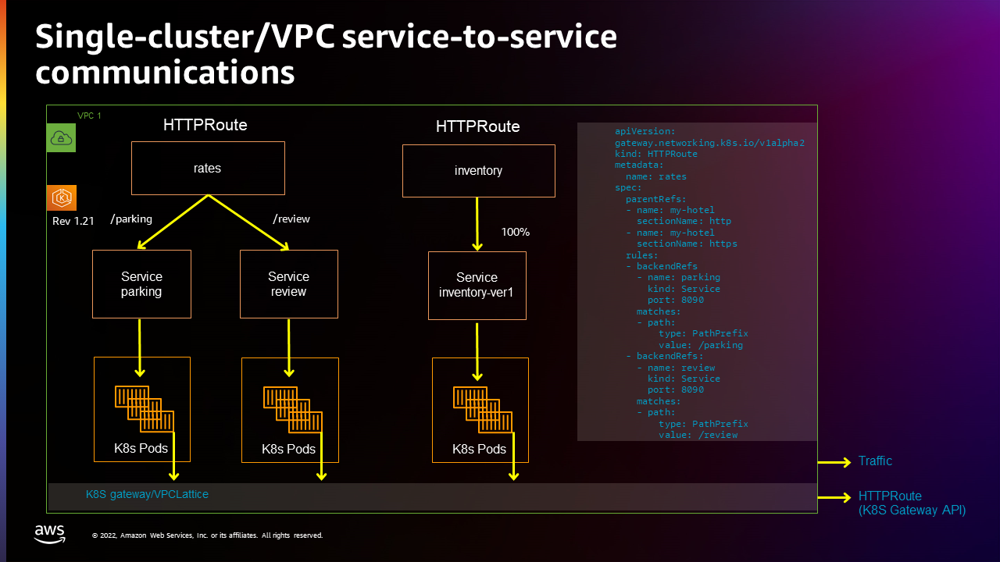

# Getting Started with AWS Gateway API Controller

Once you have [deployed the AWS Gateway API Controller](deploy.md), this guide helps you get started using the controller.

The first part of this section provides an example of setting up of service-to-service communications on a single cluster.
The second section extends that example by creating another inventory service on a second cluster on a different VPC, and spreading traffic to that service across the two clusters and VPCs.
Both clusters are created using `eksctl`, with both clusters created from the same account by the same cluster admin.

Using these examples as a foundation, see the [Configuration](../concepts/index.md) section for ways to further configure service-to-service communications.

**NOTE**: You can get the yaml files used on this page by cloning the [AWS Gateway API Controller](https://github.com/aws/aws-application-networking-k8s) repository.

## Set up single-cluster/VPC service-to-service communications

This example creates a single cluster in a single VPC, then configures two routes (rates and inventory) and three services (parking, review, and inventory-1). The following figure illustrates this setup:



### Steps

#### Setup service-to-service communications

1. AWS Gateway API Controller needs a VPC Lattice service network to operate.
   When `DEFAULT_SERVICE_NETWORK` environment variable is specified, the controller will automatically configure a service network for you.
  For example:
   ```bash

   helm upgrade gateway-api-controller \
     oci://281979210680.dkr.ecr.us-west-2.amazonaws.com/aws-gateway-controller-chart \
     --reuse-values \
     --set=defaultServiceNetwork=my-hotel
   ```
   Alternatively, you can use AWS CLI to manually create a VPC Lattice service network, with the name `my-hotel`:

   ```bash
   aws vpc-lattice create-service-network --name my-hotel # grab service network ID
   aws vpc-lattice create-service-network-vpc-association --service-network-identifier <service-network-id> --vpc-identifier <k8s-cluster-vpc-id>
   ```
   Ensure the service network created above is ready to accept traffic, by checking if the VPC association status is `ACTIVE`:
   ```bash
   aws vpc-lattice list-service-network-vpc-associations --vpc-id <k8s-cluster-vpc-id>
   {
      "items": [
         {
             ...
            "status": "ACTIVE",
             ...
         }
      ]
   }
   ```

1. Create the Kubernetes Gateway `my-hotel`:

   ```bash
   kubectl apply -f examples/my-hotel-gateway.yaml
   ```

   Verify that `my-hotel` Gateway is created with `PROGRAMMED` status equals to `True`:

   ```bash
   kubectl get gateway

   NAME       CLASS                ADDRESS   PROGRAMMED   AGE
   my-hotel   amazon-vpc-lattice               True      7d12h
   ```

1. Create the Kubernetes HTTPRoute `rates` that can has path matches routing to the `parking` service and `review` service (this could take about a few minutes)
   ```bash
   kubectl apply -f examples/parking.yaml
   kubectl apply -f examples/review.yaml
   kubectl apply -f examples/rate-route-path.yaml
   ```
1. Create another Kubernetes HTTPRoute `inventory` (this could take about a few minutes):
   ```bash
   kubectl apply -f examples/inventory-ver1.yaml
   kubectl apply -f examples/inventory-route.yaml
   ```
1. Find out HTTPRoute's DNS name from HTTPRoute status:

   ```bash
   kubectl get httproute

   NAME        HOSTNAMES   AGE
   inventory               51s
   rates                   6m11s
   ```

1. Check VPC Lattice generated DNS address for HTTPRoute `inventory` and `rates` :

   ```bash
   kubectl get httproute inventory -o yaml

   apiVersion: gateway.networking.k8s.io/v1beta1
   kind: HTTPRoute
   metadata:
     annotations:
       application-networking.k8s.aws/lattice-assigned-domain-name: inventory-default-02fb06f1acdeb5b55.7d67968.vpc-lattice-svcs.us-west-2.on.aws
   ...
   ```

   ```bash
   kubectl get httproute rates -o yaml

   apiVersion: v1
   items:
   - apiVersion: gateway.networking.k8s.io/v1beta1
     kind: HTTPRoute
     metadata:
       annotations:
         application-networking.k8s.aws/lattice-assigned-domain-name: rates-default-0d38139624f20d213.7d67968.vpc-lattice-svcs.us-west-2.on.aws
   ...
   ```

1. If the previous step returns the expected response, store VPC Lattice assigned DNS names to variables.

   ```bash
   ratesFQDN=$(kubectl get httproute rates -o json | jq -r '.metadata.annotations."application-networking.k8s.aws/lattice-assigned-domain-name"')
   inventoryFQDN=$(kubectl get httproute inventory -o json | jq -r '.metadata.annotations."application-networking.k8s.aws/lattice-assigned-domain-name"')
   ```

   Confirm that the URLs are stored correctly:

   ```bash
   echo $ratesFQDN $inventoryFQDN
   rates-default-034e0056410499722.7d67968.vpc-lattice-svcs.us-west-2.on.aws inventory-default-0c54a5e5a426f92c2.7d67968.vpc-lattice-svcs.us-west-2.on.aws
   ```

#### Verify service-to-service communications

1. Check connectivity from the `inventory-ver1` service to `parking` and `review` services:

   ```bash
   kubectl exec deploy/inventory-ver1 -- curl $ratesFQDN/parking $ratesFQDN/review
   ```

   ```
   Requsting to Pod(parking-8548d7f98d-57whb): parking handler pod
   Requsting to Pod(review-6df847686d-dhzwc): review handler pod
   ```

1. Check connectivity from the `parking` service to the `inventory-ver1` service:
   ```bash
   kubectl exec deploy/parking -- curl $inventoryFQDN
   ```
   ```
   Requsting to Pod(inventory-ver1-99d48958c-whr2q): Inventory-ver1 handler pod
   ```
   Now you could confirm the service-to-service communications within one cluster is working as expected.

## Set up multi-cluster/multi-VPC service-to-service communications

This sections builds on the previous section by migrating a Kubernetes service (HTTPRoute inventory) from one Kubernetes cluster to a different Kubernetes cluster.
For example, it will:

- Migrate the Kubernetes inventory service from a Kubernetes v1.21 cluster to a Kubernetes v1.23 cluster in a different VPC.
- Scale up the Kubernetes inventory service to run it in another cluster (and another VPC) in addition to the current cluster.

The following figure illustrates this:


### Steps

**Set up `inventory-ver2` service and serviceExport in the second cluster**

1. Create a second Kubernetes cluster `cluster2` (using the same instructions used to create the first).

1. Ensure you're using the second cluster's `kubectl` context.
   ```bash
   kubectl config get-contexts
   ```
   If your context is set to the first cluster, switch it to use the second cluster one:
   ```bash
   kubectl config use-context <cluster2-context>
   ```
1. Create a Kubernetes inventory-ver2 service in the second cluster:
   ```bash
   kubectl apply -f examples/inventory-ver2.yaml
   ```
1. Export this Kubernetes inventory-ver2 from the second cluster, so that it can be referenced by HTTPRoute in the first cluster:

   ```bash
   kubectl apply -f examples/inventory-ver2-export.yaml
   ```

   **Switch back to the first cluster**

1. Switch context back to the first cluster
   ```bash
   kubectl config use-context <cluster1-context>
   ```
1. Create Kubernetes ServiceImport `inventory-ver2` in the first cluster:
   ```bash
   kubectl apply -f examples/inventory-ver2-import.yaml
   ```
1. Update the HTTPRoute `inventory` rules to route 10% traffic to the first cluster and 90% traffic to the second cluster:
   ```bash
   kubectl apply -f examples/inventory-route-bluegreen.yaml
   ```
1. Check the service-to-service connectivity from `parking`(in cluster1) to `inventory-ver1`(in cluster1) and `inventory-ver2`(in cluster2):

   ```bash
   kubectl exec deploy/parking -- sh -c 'for ((i=1; i<=30; i++)); do curl "$0"; done' "$inventoryFQDN"

   Requsting to Pod(inventory-ver2-6dc74b45d8-rlnlt): Inventory-ver2 handler pod <----> in 2nd cluster
   Requsting to Pod(inventory-ver2-6dc74b45d8-rlnlt): Inventory-ver2 handler pod
   Requsting to Pod(inventory-ver2-6dc74b45d8-rlnlt): Inventory-ver2 handler pod
   Requsting to Pod(inventory-ver2-6dc74b45d8-rlnlt): Inventory-ver2 handler pod
   Requsting to Pod(inventory-ver2-6dc74b45d8-95rsr): Inventory-ver1 handler pod <----> in 1st cluster
   Requsting to Pod(inventory-ver2-6dc74b45d8-rlnlt): Inventory-ver2 handler pod
   Requsting to Pod(inventory-ver2-6dc74b45d8-95rsr): Inventory-ver2 handler pod
   Requsting to Pod(inventory-ver2-6dc74b45d8-95rsr): Inventory-ver2 handler pod
   Requsting to Pod(inventory-ver1-74fc59977-wg8br): Inventory-ver1 handler pod....
   ```

   You can see that the traffic is distributed between *inventory-ver1* and *inventory-ver2* as expected.

