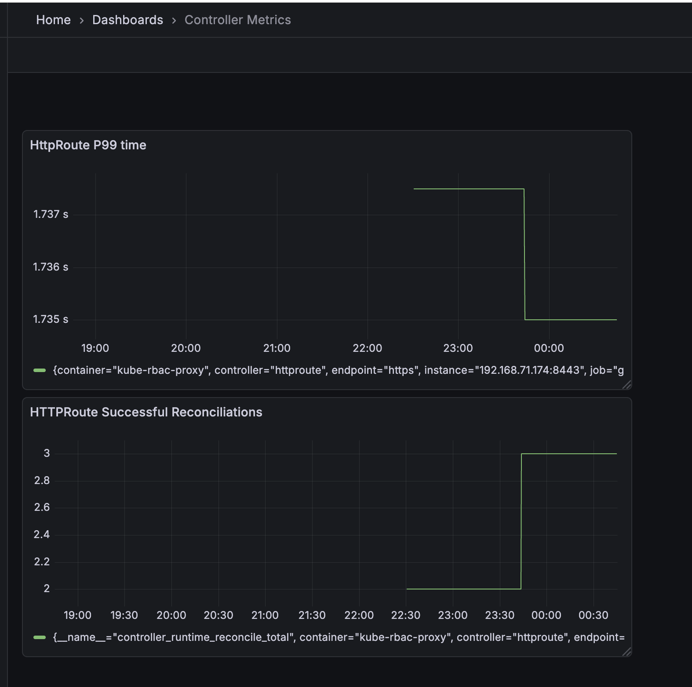

# Gateway API Controller Metrics

This guide explains how to access and monitor metrics from the AWS VPC Lattice Gateway API Controller using Prometheus and Grafana.

## Prerequisites

- A running Kubernetes cluster with the AWS VPC Lattice Gateway API Controller installed
- `kubectl` CLI tool installed and configured
- `helm` CLI tool installed

## Getting Access to Available Metrics
The controller makes metrics available via HTTP endpoint in [Prometheus metric format](https://prometheus.io/docs/instrumenting/exposition_formats/). One possible solution for collecting and visualizing these metrics is to set up Prometheus and Grafana using kube-prometheus-stack which is described in the [next section](#setting-up-prometheus-and-grafana).

### Step 1: Verify Controller is Running

First, verify that the Gateway API Controller is running:

```bash
kubectl get pods -n aws-application-networking-system
```

### Step 2: Port Forward to Metrics Endpoint

Port forward to the controller's metrics endpoint:

```bash
kubectl port-forward -n aws-application-networking-system \
  deployment/gateway-api-controller 8080:8080
```

### Step 3: Access Metrics

Access the metrics endpoint:

```bash
curl http://localhost:8080/metrics
```

This will display all available metrics exposed by the controller. 

## Setting Up Prometheus and Grafana

For a complete monitoring solution, you can set up Prometheus and Grafana to collect and visualize metrics.

### Step 1: Add Helm Repository

Add the Prometheus community Helm repository:

```bash
helm repo add prometheus-community https://prometheus-community.github.io/helm-charts
helm repo update
```

### Step 2: Create Prometheus Values File

Create a `prometheus-values.yaml` file with the following sample configuration:

```yaml
prometheus:
  prometheusSpec:
    serviceMonitorNamespaceSelector: {}
    podMonitorNamespaceSelector: {}
    serviceMonitorSelectorNilUsesHelmValues: false
    retention: 7d

grafana:
  adminPassword: admin
```

### Step 3: Install Prometheus with Custom Values

Install the Prometheus stack with your custom values:

```bash
helm install prometheus prometheus-community/kube-prometheus-stack \
  --namespace monitoring \
  --create-namespace \
  --values prometheus-values.yaml
```

### Step 4: Verify All Pods are Running

Verify that all monitoring pods are running:

```bash
kubectl get pods -n monitoring
```

### Step 5: Deploy ServiceMonitor

Deploy the ServiceMonitor to configure Prometheus to scrape metrics from the controller:

```bash
kubectl apply -f config/prometheus/monitor.yaml
```

### Step 6: Verify ServiceMonitor Deployment

Verify that the ServiceMonitor has been created:

```bash
kubectl get servicemonitor -n aws-application-networking-system
```

### Step 7: Access Prometheus

Port forward to the Prometheus service:

```bash
kubectl port-forward -n monitoring svc/prometheus-kube-prometheus-prometheus 9090:9090
```

Open [http://localhost:9090/service-discovery](http://localhost:9090/service-discovery) in your browser and verify that the service monitor is discovered.

{ width="800" }

### Step 8: Test Queries in Prometheus

Open [http://localhost:9090/query](http://localhost:9090/query) in your browser to execute queries.

Example query:

Total number of successful HTTPRoute reconciliations:
```promql
controller_runtime_reconcile_total{controller="httproute",result="success"}
```

{ width="800" }

### Step 9: Access Grafana

Port forward to the Grafana service:

```bash
kubectl port-forward -n monitoring svc/prometheus-grafana 3000:80
```

Open [http://localhost:3000/login](http://localhost:3000/login) in your browser and enter `admin/admin` as credentials.

### Step 10: Create Dashboards in Grafana

You can create custom dashboards in Grafana using the exposed metrics:

1. Go to **Dashboards**
2. Click **New dashboard** → **Add visualization**
3. Select **Prometheus** as the data source
4. Write your query

**Example queries for Grafana dashboards:**

Total number of successful HTTPRoute reconciliations:
```promql
controller_runtime_reconcile_total{controller="httproute",result="success"}
```

P99 latency for HTTPRoute reconciliations:
```promql
histogram_quantile(0.99, controller_runtime_reconcile_time_seconds_bucket{controller="httproute"})
```

{ width="800" }

## Available Metrics Reference

The controller exposes a comprehensive set of metrics that can be used for monitoring and alerting. Below is a reference of commonly used metrics organized by category.

### AWS SDK Metrics

These metrics track interactions with AWS services:

- **aws_api_call_duration_seconds** (histogram): Perceived latency from when your code makes an SDK call, includes retries
- **aws_api_call_retries** (histogram): Number of times the SDK retried requests to AWS services for SDK API calls
- **aws_api_calls_total** (counter): Total number of SDK API calls from the customer's code to AWS services
- **aws_api_request_duration_seconds** (histogram): Latency of an individual HTTP request to the service endpoint
- **aws_api_requests_total** (counter): Total number of HTTP requests that the SDK made


### Controller Runtime Metrics

These metrics track the controller's reconciliation behavior:

- **controller_runtime_active_workers** (gauge): Number of currently used workers per controller
- **controller_runtime_max_concurrent_reconciles** (gauge): Maximum number of concurrent reconciles per controller
- **controller_runtime_reconcile_errors_total** (counter): Total number of reconciliation errors per controller
- **controller_runtime_reconcile_panics_total** (counter): Total number of reconciliation panics per controller
- **controller_runtime_reconcile_time_seconds** (histogram): Length of time per reconciliation per controller
- **controller_runtime_reconcile_total** (counter): Total number of reconciliations per controller
- **controller_runtime_terminal_reconcile_errors_total** (counter): Total number of terminal reconciliation errors per controller
- **controller_runtime_webhook_panics_total** (counter): Total number of webhook panics

### Workqueue Metrics

These metrics track the internal workqueue behavior:

- **workqueue_adds_total** (counter): Total number of adds handled by workqueue
- **workqueue_depth** (gauge): Current depth of workqueue
- **workqueue_longest_running_processor_seconds** (gauge): How many seconds has the longest running processor for workqueue been running
- **workqueue_queue_duration_seconds** (histogram): How long in seconds an item stays in workqueue before being requested
- **workqueue_retries_total** (counter): Total number of retries handled by workqueue
- **workqueue_unfinished_work_seconds** (gauge): How many seconds of work has been done that is in progress and hasn't been observed by work_duration
- **workqueue_work_duration_seconds** (histogram): How long in seconds processing an item from workqueue takes
