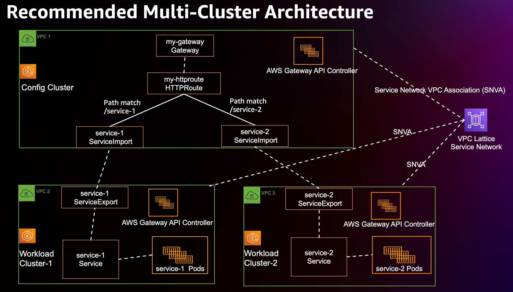

# Recommended Multi-Cluster Architecture

Here is a recommended multi-cluster architecture if you'd like to setup kubernetes service-to-service communications across multiple clusters.

Suppose your organization would like to have one large infrastructure that have many clusters in one AWS account. It's recommended your infrastructure includes the following components:
- One manually created VPC Lattice service network, (it could be created by either AWS Console, CLI, CloudFormation, Terraform or any other tools)
- Create vpc service network associations between VPC Lattice service network and each config cluster's VPC and workload clusters' VPCs
- Multiple workload cluster(s), that are used to run application workload(s). Workload cluster(s) should only have following workloads related kubernetes objects:
  - Application workload(s) (`Pod(s)`, `Deployment(s)` etc.)
  - `Service(s)` for application workload(s)
  - `ServiceExport(s)`, that export kubernetes application Service(s) to the "config cluster"
- One extra dedicated "config cluster", which acts as a "service network control plane" and it should include following kubernetes objects:
  - One `Gateway` that has __same name__ as the manually created VPC Lattice service network name
  - `ServiceImport(s)`, that reference to kubernetes application services that are exported from workload cluster(s)
  - `HTTPRoute(s)`,`GRPCRoute(s)`, that have rules backendRefs to `ServiceImport(s)` that referring kubernetes application service(s) in workload cluster(s)




Above architecture is recommended for following reasons:
- Putting all Route(s) and only one Gateway in the config cluster is easier to manage and have less chance to have conflict.
- Reduce blast radius. If there is any issue in the config cluster, it won't affect the applications in the workload cluster(s).
- It is easier to separate permissions and duties by different roles in your organization. For example:
    - The infra operator role only has permissions and manages the resource in the config cluster and VPC Lattice resource, 
    - The application developer role only has permissions and manages the resource in the workload cluster(s).


Following steps show you how to set up this recommended multi-cluster architecture with 1 config cluster and 2 workload clusters.
1. Create 3 k8s clusters: `config cluster`, `workload cluster-1`, `workload cluster-2`. Install AWS Gateway API Controller in each cluster, you could follow this instruction [deploy.md](deploy.md)
1. Create a VPC Lattice `ServiceNetwork` with name `my-gateway`
1. Create `VPCServiceNetworkAssociation(s)` between previous step created service network and each config cluster's VPC and workload clusters' VPCs
1. Setup following resource in the workload cluster1:
    ```
    kubectl apply -f files/examples/service-1.yaml
    kubectl apply -f files/examples/service-1-export.yaml
    ```
1. Setup following resource in the workload cluster2:
    ```
    kubectl apply -f files/examples/service-2.yaml
    kubectl apply -f files/examples/service-2-export.yaml
    ```
1. Setup following resource in the config cluster:
    ```
    kubectl apply -f files/examples/my-gateway.yaml
    kubectl apply -f files/examples/my-httproute.yaml
    kubectl apply -f files/examples/service-1-import.yaml
    kubectl apply -f files/examples/service-2-import.yaml
    ```
1. At this point, the connectivity setup finished, pods in workload cluster1 are able to communicate with `service-2` in workload cluster2 (and vice versa) via the `my-httproute` DNS name.
1. Furthermore, you could have more workload clusters to join the `my-gateway` service network by creating the `ServiceNewtorkAssociation(s)`, workloads there all be able to communicate with `service-1` and `service-2` via the `my-httproute` DNS name and path matching.
