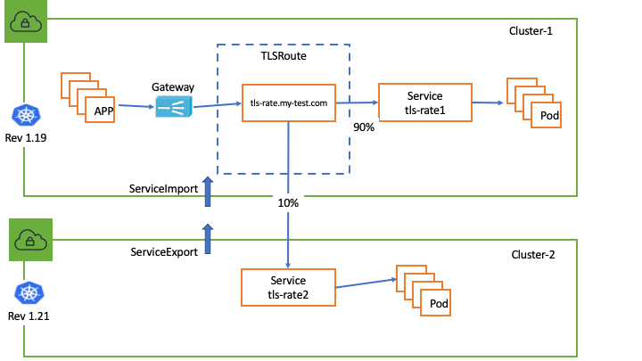

# TLS Passthrough Support 

[Kubernetes Gateway API](https://gateway-api.sigs.k8s.io/guides/tls/) lays out the general guidelines on how to configure TLS passthrough. Here are examples on how to use them against AWS Gateway Api controller and VPC Lattice.

## Install Gateway API TLSRoute CRD

The TLSRoute CRD already included in the helm chart and deployment.yaml, if you are using these 2 methods to install the controller no extra steps are needed.
If you want to install the TLSRoute CRD manually by yourself:
```
# Install CRD
kubectl apply -f config/crds/bases/gateway.networking.k8s.io_tlsroutes.yaml
# Verfiy TLSRoute CRD 
kubectl get crd tlsroutes.gateway.networking.k8s.io 
NAME                                  CREATED AT
tlsroutes.gateway.networking.k8s.io   2024-03-07T23:16:22Z
```

## Setup TLS Passthrough Connectivity in a single cluster

### 1. Configure TLS Passthrough Listener on Gateway

```
kubectl apply -f files/examples/gateway-tls-passthrough.yaml
```

```
# tls listener config snips:
apiVersion: gateway.networking.k8s.io/v1beta1
kind: Gateway
metadata:
  name: my-hotel-tls-passthrough
spec:
  gatewayClassName: amazon-vpc-lattice
  listeners:
  ...
  - name: tls
    protocol: TLS 
    port: 443
    tls:
      mode: Passthrough 
  ...
```

### 2. Configure TLSRoute

```
# Suppose in the below example, we use the "parking" service as the client pod to test the TLS passthrough traffic.
kubectl apply -f files/examples/parking.yaml

# Configure nginx backend service (This nginx image includes a self-signed certificate)
kubectl apply -f files/example/nginx-server-tls-passthrough.yaml

# configure nginx tls route
kubectl apply -f files/examples/tlsroute-nginx.yaml

```

### 3. Verify the controller has reconciled nginx-tls route

Make sure the TLSRoute has the `application-networking.k8s.aws/lattice-assigned-domain-name` annotation and status `Accepted: True`
```
kubectl get tlsroute nginx-tls -o yaml
apiVersion: gateway.networking.k8s.io/v1alpha2
kind: TLSRoute
metadata:
  annotations:
    application-networking.k8s.aws/lattice-assigned-domain-name: nginx-tls-default-0af995120af2711bc.7d67968.vpc-lattice-svcs.us-west-2.on.aws
    ...
  name: nginx-tls
  namespace: default
 ...
 
status:
  parents:
  - conditions:
    - lastTransitionTime: .....
      message: ""
      observedGeneration: 1
      reason: Accepted
      status: "True"
      type: Accepted
    - lastTransitionTime: .....
      message: ""
      observedGeneration: 1
      reason: ResolvedRefs
      status: "True"
      type: ResolvedRefs
    controllerName: application-networking.k8s.aws/gateway-api-controller

```

### 4. Verify TLS Passthrough Traffic 

```
kubectl get deployment nginx-tls 
NAME        READY   UP-TO-DATE   AVAILABLE   AGE
nginx-tls   2/2     2            2           1d

kubectl exec deployments/parking  -- curl -kv  https://nginx-test.my-test.com  --resolve nginx-test.my-test.com:443:169.254.171.0

* Trying 169.254.171.0:443...
* Connected to nginx-test.my-test.com (169.254.171.0) port 443 (#0)
* ALPN, offering h2
* ALPN, offering http/1.1
* Cipher selection: ALL:!EXPORT:!EXPORT40:!EXPORT56:!aNULL:!LOW:!RC4:@STRENGTH
* successfully set certificate verify locations:
*  CAfile: /etc/pki/tls/certs/ca-bundle.crt
*  CApath: none
* TLSv1.2 (OUT), TLS header, Certificate Status (22):
* TLSv1.2 (OUT), TLS handshake, Client hello (1):
* TLSv1.2 (IN), TLS handshake, Server hello (2):
* TLSv1.2 (IN), TLS handshake, Certificate (11):
* TLSv1.2 (IN), TLS handshake, Server key exchange (12):
* TLSv1.2 (IN), TLS handshake, Server finished (14):
* TLSv1.2 (OUT), TLS handshake, Client key exchange (16):
* TLSv1.2 (OUT), TLS change cipher, Change cipher spec (1):
* TLSv1.2 (OUT), TLS handshake, Finished (20):
* TLSv1.2 (IN), TLS change cipher, Change cipher spec (1):
* TLSv1.2 (IN), TLS handshake, Finished (20):
* SSL connection using TLSv1.2 / ECDHE-RSA-AES256-GCM-SHA384
* ALPN, server accepted to use h2
* Server certificate:
*  subject: C=US; ST=wa; L=seattle; O=aws; OU=lattice; CN=liwen.ssl-test.com; emailAddress=liwenwu@amazon.com
*  start date: Mar  5 21:26:24 2024 GMT
# use customer defined name
curl -k -v https://nginx-test.my-test.com --resolve nginx-test.my-test.com:443:169.254.171.32
* Added nginx-test.my-test.com:443:169.254.171.32 to DNS cache
* Hostname nginx-test.my-test.com was found in DNS cache
*   Trying 169.254.171.0:443...
* Connected to nginx-test.my-test.com (169.254.171.0) port 443 (#0)
* ALPN, offering h2
* ALPN, offering http/1.1
* Cipher selection: ALL:!EXPORT:!EXPORT40:!EXPORT56:!aNULL:!LOW:!RC4:@STRENGTH
* successfully set certificate verify locations:
*  CAfile: /etc/pki/tls/certs/ca-bundle.crt
*  CApath: none
* TLSv1.2 (OUT), TLS header, Certificate Status (22):
* TLSv1.2 (OUT), TLS handshake, Client hello (1):
* TLSv1.2 (IN), TLS handshake, Server hello (2):
* TLSv1.2 (IN), TLS handshake, Certificate (11):
* TLSv1.2 (IN), TLS handshake, Server key exchange (12):
* TLSv1.2 (IN), TLS handshake, Server finished (14):
* TLSv1.2 (OUT), TLS handshake, Client key exchange (16):
* TLSv1.2 (OUT), TLS change cipher, Change cipher spec (1):
* TLSv1.2 (OUT), TLS handshake, Finished (20):
* TLSv1.2 (IN), TLS change cipher, Change cipher spec (1):
* TLSv1.2 (IN), TLS handshake, Finished (20):
* SSL connection using TLSv1.2 / ECDHE-RSA-AES256-GCM-SHA384
* ALPN, server accepted to use h2
* Server certificate:
*  subject: C=US; ST=wa; L=seattle; O=aws; OU=lattice; CN=liwen.ssl-test.com; emailAddress=liwenwu@amazon.com

....
<body>
<h1>Welcome to nginx!</h1>
<p>If you see this page, the nginx web server is successfully installed and
working. Further configuration is required.</p>
....

```

## Setup TLS Passthrough Connectivity spanning multiple clusters




### 1. In this example we still use the "parking" Kubernetes service as the client pod to test the cross cluster TLS passthrough traffic.
```
kubectl apply -f files/examples/parking.yaml
```

### 2. In cluster-1, create `tls-rate1` Kubernetes Service:
```
kubectl apply -f files/examples/tls-rate1.yaml
```

### 3. Configure ServieExport with TargetGroupPolicy `protocol:TCP` in cluster-2

```
# Create tls-rate2 Kubernetes Service in cluster-2
kubectl apply -f files/examples/tls-rate2.yaml
# Create serviceexport in cluster-2
kubectl apply -f files/examples/tls-rate2-export.yaml
# Create targetgroup policy to configure TCP protocol for tls-rate2 in cluster-2
kubectl apply -f files/examples/tls-rate2-targetgrouppolicy.yaml
```

```
# Snips of serviceexport config
apiVersion: application-networking.k8s.aws/v1alpha1
kind: ServiceExport
metadata:
  name: tls-rate-2
  annotations:
    application-networking.k8s.aws/federation: "amazon-vpc-lattice"
# Snips of targetgroup policy config
apiVersion: application-networking.k8s.aws/v1alpha1
kind: TargetGroupPolicy
metadata:
    name: tls-rate2
spec:
    targetRef:
        group: "application-networking.k8s.aws"
        kind: ServiceExport
        name: tls-rate2
    protocol: TCP
```

### 4.  Configure ServiceImport in cluster1

```
kubectl apply -f files/examples/tls-rate2-import.yaml
```

### 5. Configure TLSRoute for bluegreen deployment

```
kubectl apply -f files/examples/rate-tlsroute-bluegreen.yaml

# snips of TLSRoute span multiple Kubernetes Clusters
apiVersion: gateway.networking.k8s.io/v1alpha2
kind: TLSRoute
metadata:
  name: tls-rate
spec:
  hostnames:
  - tls-rate.my-test.com
  parentRefs:
  - name: my-hotel-tls
    sectionName: tls
  rules:
  - backendRefs:
    - name: tls-rate1 <---------- to Kubernetes Cluster-1
      kind: Service
      port: 443
      weight: 10
    - name: tls-rate2 <---------- to Kubernetes Cluster-2
      kind: ServiceImport
      port: 443
      weight: 90  
```
### 6. Verify cross-cluster TLS passthrough traffic

Expected to receive the weighted traffic route to tls-rate1 service(10%) and tls-rate2 service(90%), if you curl the `tls-rate.my-test.com` from the client pod multiple times:
```
kubectl exec deploy/parking -- sh -c 'for ((i=1; i<=30; i++)); do curl -k https://tls-rate.my-test.com --resolve tls-rate.my-test.com:443:169.254.171.0 2>/dev/null; done'

Requsting to TLS Pod(tls-rate2-7f8b9cc97b-fgqk6): tls-rate2 handler pod <---->  k8s service in cluster-2
Requsting to TLS Pod(tls-rate2-7f8b9cc97b-fgqk6): tls-rate2 handler pod
Requsting to TLS Pod(tls-rate2-7f8b9cc97b-fgqk6): tls-rate2 handler pod
Requsting to TLS Pod(tls-rate2-7f8b9cc97b-fgqk6): tls-rate2 handler pod
Requsting to TLS Pod(tls-rate1-98cc7fd87a-642zw): tls-rate1 handler pod <----> k8s service in cluster-1
Requsting to TLS Pod(tls-rate2-7f8b9cc97b-fgqk6): tls-rate2 handler pod
Requsting to TLS Pod(tls-rate2-7f8b9cc97b-fgqk6): tls-rate2 handler pod
Requsting to TLS Pod(tls-rate2-7f8b9cc97b-fgqk6): tls-rate2 handler pod
Requsting to TLS Pod(tls-rate1-98cc7fd87a-642zw): tls-rate1 handler pod
```
