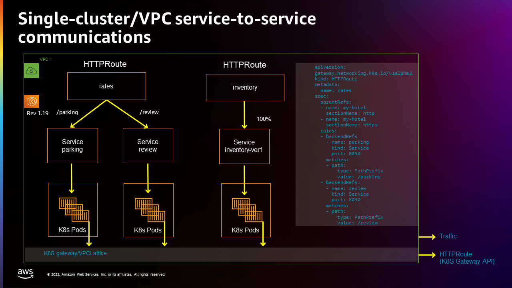
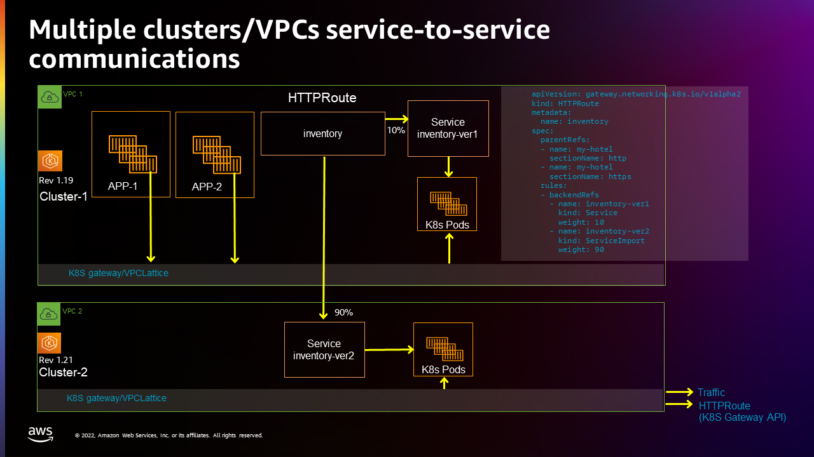
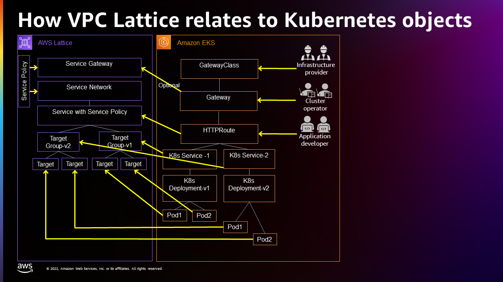

# AWS Gateway API Controller User Guide

The AWS Gateway API Controller lets you connect services across multiple Kubernetes clusters through the Kubernetes Gateway API interface.
It is also designed to connect services running on EC2 instances, containers, and as serverless functions.
It does this by leveraging Amazon VPC Lattice, which works with Kubernetes Gateway API calls to manage Kubernetes objects. 

This document describes how to set up the AWS Gateway API Controller and provides example use cases.
With the controller deployed and running, you will be able to manage services for multiple Kubernetes clusters and other targets on AWS through the following:

* **CLI**: Use `aws` and `eksctl` to create clusters and set up AWS policies. Then use `kubectl` and YAML files to set up Kubernetes objects.
* **AWS Console**: View VPC Lattice assets through the VPC area of the AWS console.

While separating the application developer from the details of the underling infrastructure, the controller also provides a Kubernetes-native experience, rather than creating a lot of new AWS ways of managing services.
It does this by integrating with the Kubernetes Gateway API.
This lets you work with Kubernetes service-related resources using Kubernetes APIs and custom resource definitions (CRDs).

For more information on this technology, see [Kubernetes Gateway API](https://gateway-api.sigs.k8s.io/). 

A few things to keep in mind:
* If you are new to the VPC Lattice service, keep in mind that names you use for objects must be unique across your entire account and not just across each cluster used by that account.
* Your AWS CNI must be v1.8.0 or later to work with VPC Lattice.

## Deploying the AWS Gateway API Controller

Follow these instructions to create a cluster and deploy the AWS Gateway API Controller.
Run through them again for a second cluster to use with the extended example shown later.

1. You can use an existing EKS cluster or create a new one as shown here:
   ```bash
   eksctl create cluster —name <my-cluster> —region us-west-2
   ```
1. Configure security group: To receive traffic from the VPC Lattice fleet, you must set up security groups so that they allow all Pods communicating with VPC Lattice to allow traffic on all ports from the 169.254.171.0/24 address range. See [Control traffic to resources using security groups](https://docs.aws.amazon.com/vpc/latest/userguide/VPC_SecurityGroups.html) for details.

1. Create an IAM OIDC provider: See [Creating an IAM OIDC provider for your cluster](https://docs.aws.amazon.com/eks/latest/userguide/enable-iam-roles-for-service-accounts.html) for details.
   ```bash
   eksctl utils associate-iam-oidc-provider --cluster <my-cluster> --approve
   ```
1. Create a policy (`recommended-inline-policy.json`) in IAM with the following content that can invoke the gateway API and copy the policy arn for later use:
   ```bash
   {
       "Version": "2012-10-17",
       "Statement": [
           {
               "Effect": "Allow",
               "Action": [
                   "vpc-lattice:*",
                   "iam:CreateServiceLinkedRole",
                   "ec2:DescribeVpcs",
                   "ec2:DescribeSubnets"
               ],
               "Resource": "*"
           }
       ]
   }
   
   }
   ```
   ```bash
   aws iam create-policy \
      --policy-name VPCLatticeControllerIAMPolicy \
      --policy-document file://recommended-inline-policy.json
   ```
1. Create the `system` namespace:
   ```bash
   kubectl apply -f examples/deploy_namespace.yaml
   ```

1. Create an iamserviceaccount for pod level permission:
   ```bash
   eksctl create iamserviceaccount \
      --cluster=<my-cluster-name> \
      --namespace=system \
      --name=gateway-api-controller \
      --attach-policy-arn=<VPCLatticeControllerIAMPolicy ARN CREATED IN create-policy STEP> \
      --override-existing-serviceaccounts \
      --region us-west-2 \
      --approve
   ```

1. Run the following to deploy the controller:
   ```bash
   kubectl apply -f examples/deploy-v0.0.1.yaml
   ```

## Using the AWS Gateway API Controller

The first part of this section provides an example of setting up of service-to-service communications on a single cluster.
The second section extends that example by creating another inventory service on a second cluster on a different VPC, and spreading traffic to that service across the two clusters and VPCs.
Both clusters are created using `eksctl`, with both clusters created from the same account by the same cluster admin.

### Set up single-cluster/VPC service-to-service communications

This example creates a single cluster in a single VPC, then configures two routes (rates and inventory) and three services (parking, review, and inventory-1). The following figure illustrates this setup:



**Steps**

   **Set up Service-to-Service communications**

1. Create the Kubernetes Gateway `my-hotel`:
   ```bash
   kubectl apply -f examples/my-hotel-gateway.yaml
   ```
1. Verify that `my-hotel` gateway is created (this could take about five minutes):
   ```bash
   kubectl get gateway  
   ```
   ```
   NAME       CLASS         ADDRESS   READY   AGE
   my-hotel   aws-lattice                     7d12h
   ```
1. Once the gateway is created, find the VPC Lattice service network:
   ```bash
   kubectl get gateway my-hotel -o yaml
   ```
   ```
   apiVersion: gateway.networking.k8s.io/v1alpha2
   kind: Gateway
   ...
   status:
   conditions:
   message: 'aws-gateway-arn: arn:aws:vpc-lattice:us-west-2:694065802095:servicenetwork/sn-0ab6bb70055929edd'
   reason: Reconciled
   status: "True"
   ```
1. Create the Kubernetes HTTPRoute rates for the parking service, review service, and HTTPRoute rate:
   ```bash
   kubectl apply -f examples/parking.yaml
   kubectl apply -f examples/review.yaml
   kubectl apply -f examples/rate-route-path.yaml
   ```
1. Create the Kubernetes HTTPRoute inventory (this could take about five minutes):
   ```bash
   kubectl apply -f examples/inventory-ver1.yaml
   kubectl apply -f examples/inventory-route.yaml
   ```
1. Find out HTTPRoute's DNS name from HTTPRoute status:
   ```bash
   kubectl get httproute
   ```
   ```
   NAME      HOSTNAMES   AGE
   httpbin               5h9m
   parking               17h
   ```
1. List the route’s yaml file to see the DNS address (highlighted here on the `message` line):
   ```bash
   kubectl get httproute parking -o yaml
   ```
   <pre>
   apiVersion: gateway.networking.k8s.io/v1alpha2
   kind: HTTPRoute
   metadata:
     annotations:
       kubectl.kubernetes.io/last-applied-configuration: |
         {"apiVersion":"gateway.networking.k8s.io/v1alpha2","kind":"HTTPRoute","metadata":{"annotations":{},"name":"parking","namespace":"default"}... }}]}]}}
   ...
   status:
     parents:
     - conditions:
       - lastTransitionTime: "2022-11-22T02:29:22Z"
         message: 'DNS Name: <b><i>parking-default-0f326944c3d681c0d.7d67968.vpc-lattice-svcs.us-west-2.on.aws</i></b>'
         reason: Reconciled
         status: "True"
         type: httproute
       controllerName: application-networking.k8s.aws/gateway-api-controller
       parentRef:
         group: gateway.networking.k8s.io
         kind: Gateway
         name: my-hotel
   ...
   </pre>

**Check service connectivity**

1. Check Service-Inventory Pod access for Service-Rates/parking or Service-Rates/review by execing into the pod, then curling each service.
   ```bash
   kubectl get pod
   ```
   ```
   NAME                                    READY   STATUS    RESTARTS   AGE
   inventory-ver1-7bb6989d9d-2p2hk         1/1     Running   0          7d13h
   inventory-ver1-7bb6989d9d-464rk         1/1     Running   0          7d13h
   parking-6cdcd5b4b4-bbzvt                1/1     Running   0          103m
   parking-6cdcd5b4b4-g8dkb                1/1     Running   0          103m
   review-5888566ff6-2plsj                 1/1     Running   0          101m
   review-5888566ff6-89fqk                 1/1     Running   0          101m
   ```
1. Exec into an inventory pod to check connectivity to parking and review services:
   ```bash
   kubectl exec -ti inventory-ver1-7bb6989d9d-2p2hk sh
   ```
1. From inside of the inventory pod, use `curl` to connect to the parking service:
   ```bash
   curl rates-00422586e3362607e.7d67968.vpc-service-network-svcs.us-west-2.amazonaws.com/parking 
   ```
   ```
   Requesting to Pod(parking-6cdcd5b4b4-g8dkb): parking handler pod
   ```
1. From inside of the pod, use `curl` to connect to the review service:
   ```bash
   curl rates-00422586e3362607e.7d67968.vpc-service-network-svcs.us-west-2.amazonaws.com/review 
   ```
   ```
   Requesting to Pod(review-5888566ff6-89fqk): review handler pod
   ```
1. Exit the pod:
   ```bash
   exit
   ```
1. Exec into a parking pod to check connectivity to the inventory-ver1 service:
   ```bash
   kubectl exec -ti parking-6cdcd5b4b4-bbzvt sh
   ```
1. From inside of the parking pod, use `curl` to connect to the inventory-ver1 service:
   ```bash
   curl inventory-00422586e3362607e.7d67968.vpc-service-network-svcs.us-west-2.amazonaws.com
   ```
   ```
   Requesting to Pod(inventory-ver1-7bb6989d9d-2p2hk): inventory-ver1 handler pod 
   ```
### Set up multi-cluster/multi-VPC service-to-service communications

This sections builds on the previous section by migrating a Kubernetes service (HTTPRoute inventory) from one Kubernetes cluster to a different Kubernetes cluster.
For example, it will:

* Migrate the Kubernetes inventory service from a Kubernetes v1.21 cluster to a Kubernetes v1.23 cluster in a different VPC.
* Scale up the Kubernetes inventory service to run it in another cluster (and another VPC) in addition to the current cluster.

The following figure illustrates this:



**Steps**

   **Set up inventory on a second cluster** 

1. Create a second cluster (using the same instructions used to create the first).

1. Switch you credentials to use the second cluster

1. Create a Kubernetes inventory-ver2 service in the second cluster:
   ```bash
   kubectl apply -f examples/inventory-ver2.yaml
   ```
1. Export this Kubernetes inventory-ver2 from the second cluster, so that it can be referenced by HTTPRoute in the other cluster:
   ```bash
   kubectl apply -f examples/inventory-ver2-export.yaml
   ```
   **Switch back to the first cluster**

1. Switch credentials back to the first cluster
   ```bash
   kubectl config use-context <yourcluster2info>
   ```
1. Import the Kubernetes inventory-ver2 into first cluster:
   ```bash
   kubectl apply -f examples/inventory-ver2-import.yaml
   ```
1. Update the HTTPRoute inventory to route 10% traffic to the first cluster and 90% traffic to the second cluster:
   ```bash
   kubectl apply -f examples/inventory-route-bluegreen.yaml
   ```
1. Check the Service-Rates/parking pod access to Service-Inventory by execing into the parking pod:
   ```bash
   kubectl exec -ti parking-6cdcd5b4b4-bbzvt sh
   ```
1. From inside of the pod, use `curl` to connect to the inventory service:
   ```bash
   curl inventory-0cd1a223d518754f3.7d67968.vpc-service-network-svcs.us-west-2.amazonaws.com
   ```
   ```
   Requesting to Pod(inventory-ver1-7bb6989d9d-2p2hk): inventory-ver1 handler pod <----> in 1st cluster
   ```
   ```bash
   curl inventory-0cd1a223d518754f3.7d67968.vpc-service-network-svcs.us-west-2.amazonaws.com
   ```
   ```
   Requesting to Pod(inventory-ver2-7bb6989d9d-2p2hk): inventory-ver2 handler pod <----> in 2nd cluster
   ```
## Understanding the Gateway API Controller

For medium and large-scale customers, applications can often spread across multiple areas of a cloud.
For example, information pertaining to a company’s authentication, billing, and inventory may each be stored by services running on different VPCs in AWS.
Someone wanting to run an application that is spread out in this way might find themselves having to work with multiple ways to configure:

* Authentication and authorization
* Observability
* Service discovery
* Network connectivity and traffic routing

This is not a new problem.
A common approach to interconnecting services that span multiple VPCs is to use service meshes. But these require sidecars, which can introduce scaling problems and present their own management challenges.  

If you just want to run an application, you should be shielded from details needed to find assets across what are essentially multiple virtual data centers (represented by multiple VPCs). You should also have consistent ways of working with assets across your VPCs, even if those assets include different combinations of instances, clusters, containers, and serverless. And while making it simpler to run multi-VPC applications easier for users, administrators still need the tools to control and audit their resources to suit their company’s compliance needs.

### Service Directory, Networks, Policies and Gateways

The goal of VPC Lattice is to provide a way to have a single, over-arching services view of all services across multiple VPCs.
The components making up that view include:

* Service Directory: This is an account-level directory for gathering your services in once place.
This can provide a view from the VPC Lattice section of the AWS console into all the services you own, as well as services that are shared with you.
A service might direct traffic to a particular service type (such as HTTP) and port (such as port 80).
However, using different rules, a request for the service could be sent to different targets such as a Kubernetes pod or a Lambda function, based on path or query string parameter.

* Service Network: Because applications might span multiple VPCs and accounts, there is a need to create networks that span those items.
  These networks let you register services to run across accounts and VPCs.
  You can create common authorization rules to simplify connectivity.

* Service Policies: You can build service policies to configure observability, access, and traffic management across any service network or gateway.
  You configure rules for handling traffic and for authorizing access.
  For now, you can assign IAM roles to allow certain requests.
  These are similar to S3 or IAM resource policies.
  Overall, this provides a common way to apply access rules at the service or service network levels.

* Service Gateway: This feature is not yet implemented.
  It is meant to centralize management of ingress and egress gateways.
  The Service Gateway will also let you manage access to external dependencies and clients using a centrally managed VPC.

If all goes well, you should be able to achieve some of the following goals:

* Kubernetes multi-cluster connectivity: Say that you have multiple clusters across multiple VPCs.
  After configuring your services with the AWS Gateway API, you can facilitate communications between services on those clusters without dealing with the underlying infrastructure.
  VPC Lattice handles a lot of the details for you without needing things like sidecars.
* Serverless access: VPC Lattice allows access to serverless features, as well as Kubernetes cluster features.
  This gives you a way to have a consistent interface to multiple types of platforms.

With VPC Lattice you can also avoid some of these common problems:

* Overlapping IP addresses: Even with well-managed IP addresses, overlapping address use can occur by mistake or when organizations or companies merge together.
  IP address conflicts can also occur if you wanted to manage resources across multiple Kubernetes clusters.
* Sidecar management: Changes to sidecars might require those sidecars to be reconfigured or rebooted.
  While this might not be a big issue for a handful of sidecars, it can be disruptive if you have thousands of pods, each with its own sidecar.

### Relationship between VPC Lattice and Kubernetes

As a Kubernetes user, you can have a very Kubernetes-native experience using the VPC Lattice APIs.
The following figure illustrates how VPC Lattice objects connect to [Kubernetes Gateway API](https://gateway-api.sigs.k8s.io/) objects:



As shown in the figure, there are different personas associated with different levels of control in VPC Lattice.
Notice that the Kubernetes Gateway API syntax is used to create the gateway, HTTPRoute and services, but Kubernetes gets the details of those items from VPC Lattice:

* Infrastructure provider: Creates the Kubernetes GatewayClass to identify VPC Lattice as the GatewayClass.
* Cluster operator: Creates the Kubernetes Gateway, which gets information from VPC Lattice related to the Service Gateway and Service Networks, as well as their related Service Policies.
* Application developer: Creates HTTPRoute objects that point to Kubernetes services, which in turn are directed to particular pods, in this case.
  This is all done by checking the related VPC Lattice Services (and related policies), Target Groups, and Targets
  Keep in mind that Target Groups v1 and v2 can be on different clusters in different VPCs.
