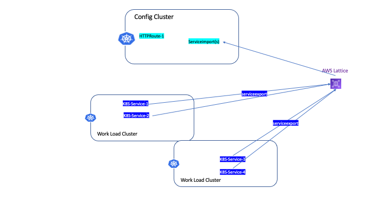

# Recommended Multi-Cluster Architecture

If you'd like to setup kubernetes service-to-service communications across multiple clusters, Following is a recommended multi-cluster architecture.

Suppose your organization have one "conceptual service mesh" that spans multiple clusters in one aws account, this service mesh should include the following components:
- One manually created VPC Lattice service network, (it could create by either AWS Console, CLI, CloudFormation, Terraform or any other tools)
- Multiple workload cluster(s), where are used to run application workload(s), workload cluster(s) should only have following kubernetes objects:
  - Multipleapplication workload(s)
- One extra dedicated "config cluster", which is used for "mesh control plane" and where should include following kubernetes objects:
  - One `gateway` that has __same name__ as the manually created VPC Lattice service network
  - Multiple HTTPRoute(s)`/`GRPCRoute(s)`, that have rules reference to kubernetes application service(s) in workload cluster(s)
  - Multiple ServiceImport(s), that reference to kubernetes application ServiceExport(s) in workload cluster(s)
Here is one popular multi-cluster architecture:

Assume your organization 
* One dedicated config cluster, where is used for Mesh control plane (For example, create Gateway, HTTPRoute, GRPCRoute in that cluster)
* multiple work-load cluster(s), where are used to run application workload(s)


You can see this similar production use case at Airbnb [airbnb mullti-cluster](https://www.youtube.com/watch?v=1D8lg36ZNHs)

Here is our example


* there are 2 gateway(s), gateway-1/lattice-service-network-1 and gateway-2/lattice-service-network-2
* gateway-1 contains HTTPRoute1 and HTTPRoute2
* gateway-2 contains HTTPRoute2 and HTTPRoute3
* blue workload cluster(s) are using gateway-1 to access HTTPRoute1 an HTTPRoute2
* orange workload cluster(s) are using gateway-2 to access HTTPRoute2 an HTTPRoute3

###  Config Cluster Gateway Configuration

```
# gateway-1
apiVersion: gateway.networking.k8s.io/v1beta1
kind: Gateway
metadata:
  name: gateway-1
  annotations:
    application-networking.k8s.aws/lattice-vpc-association: "false"  # not associate to VPC
spec:
  gatewayClassName: amazon-vpc-lattice
  listeners:
  ...
```  

```
# gateway-2
apiVersion: gateway.networking.k8s.io/v1beta1
kind: Gateway
metadata:
  name: gateway-2
  annotations:
    application-networking.k8s.aws/lattice-vpc-association: "false"  # not associate to VPC
spec:
  gatewayClassName: amazon-vpc-lattice
  listeners:
  ...
```  

```
# httproute-1
apiVersion: gateway.networking.k8s.io/v1beta1
kind: HTTPRoute
metadata:
  name: httproute-1
spec:
  parentRefs:
  - name: gateway-1  # part of gateway-1/service-network-1
  ...
```  

```
# httproute-2
apiVersion: gateway.networking.k8s.io/v1beta1
kind: HTTPRoute
metadata:
  name: httproute-2
spec:
  parentRefs:
  - name: gateway-1     # part of both gateway-1 and gateway-2 
    sectionName: http
  - name: gateway-2
    sectionName: http
  ...    
  ```

  ```
# httproute-3
apiVersion: gateway.networking.k8s.io/v1beta1
kind: HTTPRoute
metadata:
  name: httproute-3
spec:
  parentRefs:
  - name: gateway-2  # part of gateway-2/service-network-2
  ...
```

### blue workload cluster(s)
Associate cluster's VPC to gateway-1/service-network-1 so that all Pod(s) in blue workload clusters can access HTTPRoute(s)of gateway-1, HTTPRoute-1 and HTTPRoute-2

```
# gateway-1
apiVersion: gateway.networking.k8s.io/v1beta1
kind: Gateway
metadata:
  name: gateway-1
spec:
  gatewayClassName: amazon-vpc-lattice
  listeners:
  ...
```  

### orange workload cluster(s)
Associate cluster's VPC to gateway-2/service-network-2, so that all Pod(s) in orange workload clusters can access HTTPRoute(s) of gateway-2, HTTPRoute-2 an HTTPRoute-3

```
# gateway-2
apiVersion: gateway.networking.k8s.io/v1beta1
kind: Gateway
metadata:
  name: gateway-2
spec:
  gatewayClassName: amazon-vpc-lattice
  listeners:
  ...
```  

## Defining HTTPRoute in Config Cluster



### Exporting Kubernetes Service to AWS Lattice Service

In workload cluster, exports k8s service to AWS VPC lattice

```
# in workload cluster(s)
apiVersion: application-networking.k8s.aws/v1alpha1
kind: ServiceExport
metadata:
  name: service-1
  annotations:
          application-networking.k8s.aws/federation: "amazon-vpc-lattice"  #  AWS VPC Lattice
``` 

### Configure HTTPRoute in config cluster to reference K8S service(s) in worload cluster(s)

```
# in config cluster
apiVersion: application-networking.k8s.aws/v1alpha1
kind: ServiceImport
metadata:
  name: service-1
spec:
  type: ClusterSetIP
  ports:
  - port: 80
    protocol: TCP
```

```
# httproute 
apiVersion: gateway.networking.k8s.io/v1beta1
kind: HTTPRoute
metadata:
  name: httproute-1
spec:
  parentRefs:
  - name: gateway-1
    sectionName: http 
  rules:
  - backendRefs:  
    - name: service-1
      kind: ServiceImport
      weight: 25
    - name: service-2
      kind: ServiceImport
      weight: 25  
    - name: service-3
      kind: ServiceImport
      weight: 25
    - name: service-4
      kind: ServiceImport
      weight: 25    
```      


