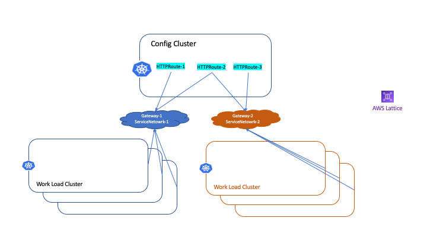

# Multiple Gateways/Service Networks and HTTPRoute Associates to Multiple Gateways

## Multiple Gateways/Service Networks Usecase

Here is one popular multi-cluster architecture:

* config cluster, where is used to configuration management
* multiple work-load cluster(s), where are used to run application workload(s)

You can see a production usecase at AirBnb [airbnb mullti-cluster](https://www.youtube.com/watch?v=1D8lg36ZNHs)

Here is our example



* there are 2 gateway(s), gateway-1/lattice-service-network-1 and gateway-2/lattice-service-network-2
* gateway-1 contains HTTPRoute1 and HTTPRoute2
* gateway-2 contains HTTPRoute2 and HTTPRoute3
* blue workload cluster(s) are using gateway-1 to access HTTPRoute1 an HTTPRoute2
* orange workload cluster(s) are using gateway-2 to access HTTPRoute2 an HTTPRoute3

###  Config Cluster Gateway Configuration

```
# gateway-1
apiVersion: gateway.networking.k8s.io/v1beta1
kind: Gateway
metadata:
  name: gateway-1
  annotations:
    application-networking.k8s.aws/lattice-vpc-association: "false"  <-----> not associate to VPC
spec:
  gatewayClassName: amazon-vpc-lattice
  listeners:
  ...
```  

```
# gateway-2
apiVersion: gateway.networking.k8s.io/v1beta1
kind: Gateway
metadata:
  name: gateway-2
  annotations:
    application-networking.k8s.aws/lattice-vpc-association: "false"  <-----> not associate to VPC
spec:
  gatewayClassName: amazon-vpc-lattice
  listeners:
  ...
```  

```
# httproute-1
apiVersion: gateway.networking.k8s.io/v1beta1
kind: HTTPRoute
metadata:
  name: httproute-1
spec:
  parentRefs:
  - name: gateway-1  <---> part of gateway-1/service-network-1
  ...
```  

```
# httproute-2
apiVersion: gateway.networking.k8s.io/v1beta1
kind: HTTPRoute
metadata:
  name: httproute-2
spec:
  parentRefs:
  - name: gateway-1     <------> part of both gateway-1 and gateway-2 
    sectionName: http
  - name: gateway-2
    sectionName: http
  ...    
  ```

  ```
# httproute-3
apiVersion: gateway.networking.k8s.io/v1beta1
kind: HTTPRoute
metadata:
  name: httproute-3
spec:
  parentRefs:
  - name: gateway-2  <---> part of gateway-2/service-network-2
  ...
```

### blue workload cluster(s)
Associate cluster's VPC to gateway-1/service-network-1 so that all Pod(s) in blue workload clusters can access HTTPRoute(s)of gateway-1, HTTPRoute-1 and HTTPRoute-2

```
# gateway-1
apiVersion: gateway.networking.k8s.io/v1beta1
kind: Gateway
metadata:
  name: gateway-1
  annotations:
    application-networking.k8s.aws/lattice-vpc-association: "true"  <----->  associate to VPC
spec:
  gatewayClassName: amazon-vpc-lattice
  listeners:
  ...
```  

### orange workload cluster(s)
Associate cluster's VPC to gateway-2/service-network-2, so that all Pod(s) in orange workload clusters can access HTTPRoute(s) of gateway-2, HTTPRoute-2 an HTTPRoute-3

```
# gateway-2
apiVersion: gateway.networking.k8s.io/v1beta1
kind: Gateway
metadata:
  name: gateway-2
  annotations:
    application-networking.k8s.aws/lattice-vpc-association: "true"  <----->  associate to VPC
spec:
  gatewayClassName: amazon-vpc-lattice
  listeners:
  ...
```  


